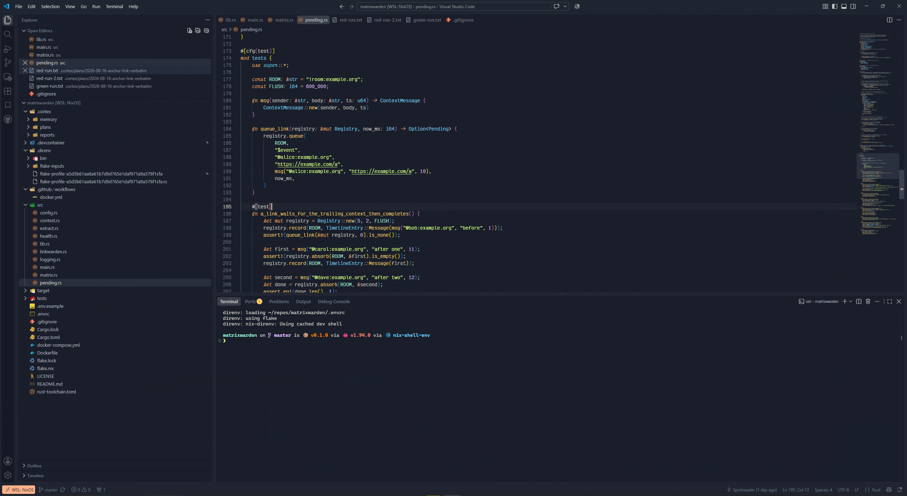

# Ayu Newrage

A dark VS Code theme that puts [ayu Mirage](https://marketplace.visualstudio.com/items?itemName=teabyii.ayu)
syntax colors on [Mayukai Mirage](https://marketplace.visualstudio.com/items?itemName=GulajavaMinistudio.mayukaithemevsc)
chrome.

The theme targets VS Code's modern UI. That rendering computes parts of the
workbench from theme colors instead of reading them directly, so a palette tuned
for the classic chrome can wash out once those formulas run. Ayu Mirage's look
survives intact here, with the contrast underneath it raised so both rendering
paths stay readable. [Tabs under the modern UI](#tabs-under-the-modern-ui) covers
where that matters most.



Rust in the editor, with the explorer, modern UI tabs and integrated terminal.

## What comes from where

Mayukai Mirage supplies the workbench: editor foreground `#dadbc0`, its opaque
grey selection `#3d424d`, activity bar, tabs, title bar and status bar.

ayu Mirage supplies everything inside the code:

| | |
|---|---|
| `tokenColors` | 65 rules, ayu's set replacing Mayukai's 92 |
| `semanticTokenColors` | ayu's 21 rules; semantic highlighting is on (Mayukai ships none) |
| git decorations | ayu's semantics: modified `#80bfff`, untracked `#87d96c`, deleted `#f27983`. Mayukai had modified green and untracked red. Added, renamed and the staged variants are new here |
| `editorCursor.foreground` | `#ffcc66` gold, replacing Mayukai's red `#ff4057` |
| `terminalCursor.foreground` | `#ffcc66`, matching the editor cursor |
| `editorMultiCursor.*` | `#ffcc66` |
| 16 ANSI terminal colors | ayu's palette, so terminal output matches the syntax colors |
| `button.*` | gold `#ffcc66` on `#735923`, replacing Mayukai's hotter orange `#ffb454` |
| `editorInlayHint.foreground` | `#cccac280`, which Mayukai leaves unset |

## Deviations from both sources

### One flat editor surface at `#191e2a`

`terminal.background` (was `#1b1c24`), `panel.background` (was `#1b1c24`),
`debugConsole.background` (was unset), `tab.activeBackground` (was `#232834`) and
`editorGroup.emptyBackground` (was `#232834`) all moved onto the editor
background. The gold top border sets the active tab apart instead of a background
shift, the way ayu Mirage does it.

### Tab strip contrast

Mayukai's tab foregrounds ran from `#707a8c` to `#dadbc0`, which put inactive tabs
at 3.6:1 against the strip. WCAG AA asks 4.5:1 of body text. Every tab state is
white now, and every one clears AAA:

| | on | ratio | |
|---|---|---|---|
| `tab.activeForeground` `#ffffff` | `#191e2a` | 16.66:1 | AAA |
| `tab.inactiveForeground` `#ffffff` | `#1f2430` | 15.52:1 | AAA |
| `tab.unfocusedActiveForeground` `#ffffff` | `#191e2a` | 16.66:1 | AAA |
| `tab.unfocusedInactiveForeground` `#ffffff` | `#1f2430` | 15.52:1 | AAA |
| `tab.selectedForeground` `#ffffff` | `#232834` | 14.74:1 | AAA |

The gold top border and the background step from `#191e2a` to `#1f2430` tell
active and inactive tabs apart, rather than a dimmed label. Dimming is what put
Mayukai's inactive tabs below AA to begin with.

### Git decorations

ayu and Mayukai both set only modified, deleted and untracked. The other four
decoration slots fell through to VS Code's built-in dark defaults, which are the
stock red/amber/green set and ignore the theme entirely. `A` and `U` in the
explorer both landed on a green, because untracked was ayu's `#87d96c` and added
was the default `#81b88b`. All seven are explicit now:

| | | on `#191e2a` |
|---|---|---|
| `modifiedResourceForeground` | `#80bfff` | 8.58:1 |
| `stageModifiedResourceForeground` | `#80bfff` | 8.58:1 |
| `addedResourceForeground` | `#bae67e` | 11.67:1 |
| `untrackedResourceForeground` | `#87d96c` | 9.66:1 |
| `renamedResourceForeground` | `#93e2c8` | 11.07:1 |
| `deletedResourceForeground` | `#f27983` | 6.22:1 |
| `stageDeletedResourceForeground` | `#f27983` | 6.22:1 |

Added and untracked stay in the green family because both mean new content, but
added is ayu's yellow-green against untracked's leaf green, so the two badges
read apart. Staged modify and delete match their unstaged counterparts; the
badge letter carries the staging, not the hue.

### Menus

Mayukai defines no `menu.*` colors, so `menu.foreground` inherited
`dropdown.foreground` at `#707a8c`, which is 3.41:1 on the menu surface. The full
set is explicit here, with `menu.foreground` `#c2c6cc` at 8.59:1.

### Remote indicator

`statusBarItem.remoteBackground` was `#ff9940` with no foreground set, so VS Code
defaulted to white at 2.1:1. It is pastel `#ffb38a` now, with an explicit
`#1f2430` foreground at 8.92:1 and a matching hover pair.

## Tabs under the modern UI

The table above is what the `tab.*` tokens ask for, and what the classic tab strip
gives you. With `workbench.experimental.modernUI` enabled, VS Code ignores most of
them and sets tab labels in CSS with `!important`, computed from the global
`foreground` token:

| | source | with `foreground` `#adb3be` | ratio |
|---|---|---|---|
| active label | `foreground` | `#adb3be` | 5.02:1 |
| active fill | `color-mix(foreground 22%, editor.background)` | `#3a3f4b` | n/a |
| inactive label | `foreground` at 50% alpha | `#636974` | 3.00:1 |
| selected label | `tab.selectedForeground` | `#ffffff` | honored |

That formula narrows what a theme can control:

- `tab.activeForeground`, `tab.inactiveForeground` and both `unfocused*` variants
  do nothing. `tab.selectedForeground` is the one label token still read.
- The active tab's fill derives from the same token as its text, so the two move
  together. Darkening the highlight darkens the label faster than the background,
  which costs contrast rather than gaining it.
- Inactive labels sit at a fixed 50% alpha and top out near 4.4:1 whatever the
  theme does. `foreground` is `#adb3be` here, matching `sideBar.foreground`, so
  the tabs and the explorer tree read as one surface.

Labels carrying a git decoration are exempt from the override and keep their
decoration color. Setting `workbench.experimental.modernUI` to `false` hands every
row in that table back to the `tab.*` tokens.

## Install

From the Marketplace, `Ctrl+P` and then:

```
ext install walzengroup.ayu-newrage
```

Or copy this folder into your extensions directory:

```powershell
# VS Code
Copy-Item -Recurse . "$env:USERPROFILE\.vscode\extensions\ayu-newrage-1.0.1"

# Cursor
Copy-Item -Recurse . "$env:USERPROFILE\.cursor\extensions\ayu-newrage-1.0.1"
```

Then `Ctrl+Shift+P` and Developer: Reload Window, `Ctrl+K Ctrl+T`, and pick
Ayu Newrage.

To build a `.vsix` instead:

```powershell
npx @vscode/vsce package
code --install-extension ayu-newrage-1.0.1.vsix
```
